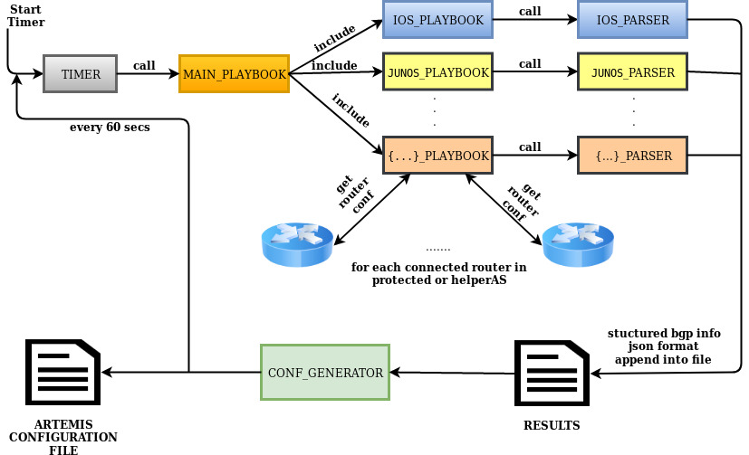

Ansible-based Auto-Configuration and Auto-Mitigation Mechanisms in ARTEMIS
  * [General](#general)
  * [Setup and Install](#setup-and-install)
  * [Configure](#configure)
  * [Run](#run)
  * [Contact](#contact)

## General

This repository contains prototype software to enable auto-configuration and auto-mitigation in ARTEMIS using Ansible. 

*Note that while this has been tested in an emulation environment (GNS3) and works in the current form, we are in the process of integrating it as a set of auto-configuration and auto-mitigation microservices in the ARTEMIS container-based architecture.*

## System Architecture



## Setup and Install

1. First, install ARTEMIS on your host machine following exactly the steps described in [ARTEMIS wiki](https://github.com/FORTH-ICS-INSPIRE/artemis/wiki#artemis-installation-and-setup).
  
2. Clone the current repository (`artemis-ansible`) within `artemis/backend` directory. 

3. In `artemis/docker-compose.yaml`, under section `services` and tag `backend` replace the following line:
   ```
   image: inspiregroup/artemis-backend:${SYSTEM_VERSION}  
   ```
   with:
   ```
   build: ./backend
   ```
4. In `artemis/docker-compose.yaml` add the following mappings under section `services`, tag `backend`, sub-tag `volumes`:
   ```
   - ./backend/artemis-ansible/automation_tools/configs/admin_configs.json:/root/admin_configs.json
   - ./backend/artemis-ansible/automation_tools/configs/ansible/hosts:/root/hosts
   - ./backend/artemis-ansible/automation_tools/configs/ansible/ansible.cfg:/etc/ansible/ansible.cfg
   - ./backend/artemis-ansible/automation_tools/auto_configuration/playbooks/main_playbook.yaml:/root/main_playbook.yaml
   - ./local_configs/backend/config.yaml:/root/config.yaml
   - ./backend/artemis-ansible/automation_tools/auto_configuration/core/conf_generator.py:/root/conf_generator.py
   - ./backend/artemis-ansible/automation_tools/auto_configuration/parsers/ios_parser.py:/root/ios_parser.py
   - ./backend/artemis-ansible/automation_tools/auto_configuration/playbooks/ios_playbook.yaml:/root/ios_playbook.yaml
   - ./backend/artemis-ansible/automation_tools/auto_configuration/core/timer.py:/root/timer.py
   - ./backend/artemis-ansible/automation_tools/utils/conf_lib.py:/root/conf_lib.py
   - ./backend/artemis-ansible/automation_tools/utils/logger.py:/root/logger.py
   - ./backend/artemis-ansible/automation_tools/configs/logging.yaml:/etc/artemis/automation_tools/logging.yaml
   ```
   Optionally, if you want to also enable auto-mitigation (besides auto-configuration) capabilities, please add the following mappings:
   ```
   - ./backend/artemis-ansible/automation_tools/auto_mitigation/playbooks/mitigation_playbook.yaml:/root/mitigation_playbook.yaml
   - ./backend/artemis-ansible/automation_tools/auto_mitigation/playbooks/tunnel_mitigation_playbook.yaml:/root/tunnel_mitigation_playbook.yaml
   - ./backend/artemis-ansible/automation_tools/auto_mitigation/core/mitigation_trigger.py:/root/mitigation_trigger.py
   - ./backend/artemis-ansible/automation_tools/auto_mitigation/playbooks/ios_mitigation.yaml:/root/ios_mitigation.yaml
   - ./backend/artemis-ansible/automation_tools/auto_mitigation/playbooks/ios_tunnel_mitigation.yaml:/root/ios_tunnel_mitigation.yaml
   ```
5. In `artemis/backend/requirements.txt` add the following modules:
   ```
   - py-radix==0.10.0
   - json-schema-matcher==0.1.7.1
   - ciscoconfparse==1.4.7 
   - filelock==3.0.12 
   ```
6. In `artemis/backend/Dockerfile` before `WORKDIR /root` command add the following commands in order to install Ansible on the backend container:
   ```
   RUN apk update
   RUN apk add --no-cache ansible
   ```

7. In `artemis/backend/Dockerfile` after `COPY . ./` command add the following commands in order to save log messages from both auto-configuration and auto-mitigation mechanisms:
   ```
   RUN mkdir -p /var/log/artemis/auto_configuration/
   RUN mkdir -p /var/log/artemis/auto_mitigation/
   RUN mkdir -p /etc/ansible/
   ``` 

8. Open a terminal in `artemis` directory, stop and re-build ARTEMIS with ansible:
   ```
   docker-compose stop
   docker-compose build
   ```

## Configure

1. In `artemis/backend/artemis-ansible/automation_tools/configs/ansible/hosts` you must define the directly connected routers of your network from which the auto-configuration mechanism gets feed in order to produce the ARTEMIS Configuration File. The structure is hierarchical, and looks as follows:     
   ```
   [ASN:children]
   vendor1-ASN
   vendor2-ASN
      .....
   vendorX-ASN

   [vendor1-ASN:children]
   ASN_router-id1
   ASN_router-id2
      .....
   ASN_router-idX

   [ASN_router-id1]
   ansible_host="IP address or the domain name of the host to connect to"

   [ASN_router-id2]
   ansible_host="IP address or the domain name of the host to connect to"

   ......

   [ASN_router-idX]
   ansible_host="IP address or the domain name of the host to connect to"
  
   [vendor1-ASN:vars]
   ansible_user= "ssh username for router"
   ansible_ssh_pass="ssh password for router"
   ansible_connection=network_cli
   ansible_network_os={ios, eos, junos, ...}
   ansible_become=yes
   ansible_become_method=enable 
   
   ........
   ```   
   Note that the following primitives are involved:
   - `ASN` is the Autonomous System Number to which directly connected routers `ASN_router-id{1,2, N}` belong.    
   - You must specify the ASN and the real router-id in groups and subgroups in host file. For example parent group `[ASN:children]` could be in format `[65001:children]`. Children group `[ASN_router-idX]` could be in format `[65001_192.168.10.1]` or `[40_c3725]`. 
   - If you have directly connected routers which belong to different ASNs, you must create exactly the above schema multiple times (for each ASN).

   For Example a real host file would look as follows:
   ```
   [65001:children]
   CISCO-ROUTERS-65001

   [65006:children]
   CISCO-ROUTERS-65006

   [CISCO-ROUTERS-65001:children]
   65001_192.168.10.1

   [CISCO-ROUTERS-65006:children]
   65006_192.168.100.2

   [65001_192.168.10.1]
   c7200_Stable ansible_host=192.168.10.1

   [65006_192.168.100.2]
   helper_as ansible_host=192.168.100.2

   [CISCO-ROUTERS-65001:vars]
   ansible_user=admin
   ansible_ssh_pass=george
   ansible_connection=network_cli
   ansible_network_os=ios
   ansible_become=yes
   ansible_become_method=enable 

   [CISCO-ROUTERS-65006:vars]
   ansible_user=admin1234
   ansible_ssh_pass=george1234
   ansible_connection=network_cli
   ansible_network_os=ios
   ansible_become=yes
   ansible_become_method=enable 
   ```
2. Edit `admin_configs.json` according to your preferences. For more details, check the example in the repository.

   a) You must add the following backend container paths for the following files (here we show default values):
      ```
      "main_playbook_path": "/root/main_playbook.yaml",
      "mitigation_playbook_path": "/root/mitigation_playbook.yaml",
      "tunnel_mitigation_playbook_path": "/root/tunnel_mitigation_playbook.yaml",
      "ansible_hosts_file_path": "/root/hosts",
      "artemis_config_file_path": "/root/config.yaml",
      "config_generator_path": "/root/conf_generator.py",
      "bgp_results_path": "/root/results.json",
      "mitigation_script_path": "/root/mitigation_trigger.py",
      ``` 
     
      *You may change the default paths; however, it is not recommended !!!*
   
   b) Add the CISCO IOS router configuration file parser path as following:
      ```
      "parsers_paths": {
        "ios_parser": "/root/ios_parser.py",
      },
      ```
      *This is the default parser that we have implemented and use.
      If you want to add your own additional parsers contact developers for additional information on code support.*
          
   
   c) Add all monitors that will provide BGP updates as follows:
      ```
      "monitors": {
        "riperis": [""],
        "bgpstreamlive": ["routeviews", "ris", "caida"],
        "exabgp":[{
          "ip": "exabgp",
          "port": 5000
        }]
      },
      ```
     For more details check Monitor Section of [ARTEMIS Configuration File wiki](https://github.com/FORTH-ICS-INSPIRE/artemis/wiki/Configuration-file#monitors).

   d) Optionally, if you want to also configure the auto-mitigation mechanism, please add the following:
   ```
   "mitigation": {
     "configured_prefix":{
       "x.x.x.x/x": {
         "netmask_threshold": (integer),
         "less_than_threshold": {"deaggregate" | "tunnel" | "deaggregate+tunnel" | "manual"},
         "equal_greater_than_threshold": {"tunnel" | "manual"},
         "tunnel_definitions": {
           "helperAS": {
             "asn": (integer),
             "router_id": (string),
             "tunnel_interface_name": (string),
             "tunnel_interface_ip_address": "x.x.x.x",
             "tunnel_interface_ip_mask": "x.x.x.x",
             "tunnel_source_ip_address": "x.x.x.x",
             "tunnel_source_ip_mask": "x.x.x.x",
             "tunnel_destination_ip_address": "x.x.x.x",
             "tunnel_destination_ip_mask": "x.x.x.x"
           }
         }
       },
       ....
     }
   }
   ```
   Where the `configured_prefix` dictionary contains prefixes `x.x.x.x/x` which are configured in ARTEMIS Configuration File. For each `configured_prefix` you have the ability to define the mitigation technique which you want to apply according to the hijacked prefix length. Available mitigation techniques are `prefix_deaggregation` and `tunneling`. A detailed explanation of the different keys is as follows:
   - "x.x.x.x/x" : A valid configured prefix which is configured in ARTEMIS Configuration File.
   - "netmask_threshold" : Hijacked prefix length threshold.
   - "less_than_threshold" : Which technique to apply if hijacked prefix length < "netmask_threshold". You can declare, "deaggregate" which means apply deaggregation technique, "tunnel" which means apply tunneling technique, "deaggregate+tunnel" which means apply deaggregation and tunneling technique and "manual" which means do not apply any mitigation technique.
    - "equal_greater_than_threshold" : Which technique to apply if hijacked prefix length >= "netmask_threshold". You can declare, "tunnel" which means apply tunneling technique and "manual" which means do not apply any mitigation technique. Deaggregation is not meaningfull for very specific prefixes due to filtering.
    - "asn" : ASN of AS from which we ask help (tunnel technique).
    - "router_id" : Real router-id of helper AS router with which ARTEMIS VM and at least one router in our AS is directly connected (via physical links). Over the physical link beetween helper AS router and router in our AS (origin AS router) we assume a pre-installed GRE tunnel to which all hijacked traffic attracted by helper AS will be redirected.
    - "tunnel_interface_name" : Tunnel interface name of helper AS router to which hijacked traffic will be redirected.
    - "tunnel_interface_ip_address" : Tunnel interface ip address of helper AS router to which hijacked traffic will be redirected.
    - "tunnel_interface_ip_mask" : Tunnel interface ip netmask of helper AS router to which hijacked traffic will be redirected.
    - "tunnel_source_ip_address" : Physical source interface ip address of GRE tunnel (helper AS router).
    - "tunnel_source_ip_mask" : Physical source interface ip netmask of GRE tunnel (helper AS router).
    - "tunnel_destination_ip_address" : Physical destination interface ip address of GRE tunnel (origin AS router).
    - "tunnel_destination_ip_mask" : Physical destination interface netmask of GRE tunnel (origin AS router).
    ```
 For more information on the different mitigation techniques please consult [the ARTEMIS paper](https://arxiv.org/pdf/1801.01085.pdf).
 
## Run

1. First, boot ARTEMIS:
   ```
    docker-compose -f docker-compose.yaml -f docker-compose.exabgp.yaml up -d
    ```
2. Then, connect to the running backend container:
   ```
   docker-compose exec backend bash
   ```
3. On the backend terminal, initiate the auto-configuration timer:
   ```
    ./timer.py /root/admin_configs.json
   ```

That's it !!! From now on, the Auto-Configuration Mechanism executes its work periodically, by polling the connected routers. All changes in ARTEMIS Configurations File will appear in ARTEMIS UI.

## Contact
In case of questions or requests for contributions please contact `csd3590[at]csd[dot]uoc[dot]gr`.
